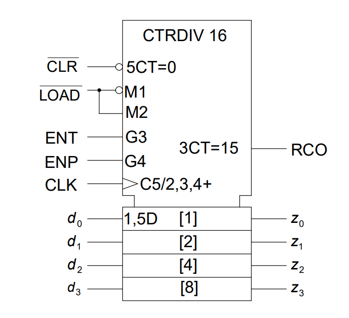

# VHDL Stoppuhr Controller

_Gruppe: Ben Bekir Ertugrul, Frederik Höft, Manuele Waldheim und Henri Betz_

---

Dieses Dokument dient als Übersicht der erbrachten Leistungen innerhalb des VHDL-Projektes.

## Implementation des Stoppuhr-Controllers

Der Stoppuhr-Controller wurde als Automat in VDL implementiert. Die Zustände und die Zustandsübergänge des Automaten werden in der folgenden Abbildung veranschaulicht.


Wie dargestellt sind die Zustandsübergänge primär von zwei Knöpfen abhängig:
- Button 1 = Start/Stopp (High-active)
- Button 2 = Reset (High-active)

Es gibt jedoch auch einen dritten Knopf, welcher einen System-Reset auslöst und damit direkt in Zustand "zero" führt:
- Button 3 = System-Reset (Low-active)

Um die Metastabilität zu berücksichtigen, wurden vor jeden Input (Start/Stopp, Reset, System-Reset) jeweils zwei Synchronisations-Flipflops in Reihe geschaltet, die durch einen Prozess verwaltet werden.

Die Ausgänge der Zustände lauten wie folgt:
- Output 1 = Watch running (High-active)
- Output 2 = Watch reset (High-active)

### Testabdeckung

Die zur Verfügung gestellte Testbench wurde in das Projekt eingebunden und für alle Tests benutzt.
Die Testabdeckung liegt bei 100%. Es wurden alle Zuständsübergänge, inklusive der System Resets getestet.


## Selbstentwickelter Test-Preprocessor

_Der source code finden Sie in `/csharp-comment-parser/src`. Pre-compiled executables für Windows/Linux x64 sind verfügbar in der [GitHub Releases](https://github.com/frederik-hoeft/fhdw-vhdl-stopwatch/releases)._

---

Um die Tests des Stoppuhr-Controllers möglichst angenehm zu gestalten, wurde ein C\#/.NET Programm erstellt, welches annotierte CSV Dateien in TXT Dateien umwandelt. Dies ermöglicht es mithilfe von CSV kompatiblen Editoren (wie Microsoft Excel) Testdaten anzulegen und mit Notizen zu versehen, was die Daten auch für Dritte einsichtiger macht. Die Testdaten werden dann ohne die Kommentare in TXT Dateien kopiert, in denen sie so aufbereitet werden, dass sie für das Testframework genutzt werden können.

### CSV Struktur
Damit das C\#-Programm die Testdaten verarbeiten kann, wird der Aufbau der CSV Datei wie folgt vorgeschrieben:
- Die erste Zeile kann für Kommentare o.Ä. verwendet werden.
- Die erste Spalte kann für Kommentare o.Ä. verwendet werden.
- Die Input-Daten fangen ab Zeile 2 Spalte 2 an. Für jedes Input-Feld wird eine neue Spalte hinzugefügt.
- Die Output-Daten werden durch eine leere Spalte von den Input-Daten getrennt. Für jedes Output-Feld wird eine neue Spalte hinzugefügt.
- Ein Input-Output-Datenpaar steht in einer Zeile.

Der folgende Bildschirmausschnitt veranschaulicht die oben beschriebene Struktur anhand eines Beispiels mit drei Input-Feldern und zwei Output-Feldern. **(1)**


### TXT Struktur
Pro CSV Datei werden zwei TXT Dateien erstellt. Eine Datei beinhaltet die Input-Felder und eine Datei beinhaltet die Output-Felder. Daten in verschiedenen Spalten werden durch Leerzeichen separiert. Die Daten werden unter Beeinhaltung der angegebenen Reihenfolge kopiert, jedoch wird der letzte Input-Datensatz, sowie der erste Output-Datensatz zwei Mal eingefügt, da die Zustandsänderung um einen Takt nach hinten verschoben ist.

Die generierten Dateien passend zu Beispiel **(1)** sehen wie folgt aus:

*Input.txt*
```
0 0 0
0 0 1
0 1 1
1 0 1
1 0 1
1 1 1
0 1 1
0 0 1
0 0 1
0 1 1
1 0 1
0 1 1
1 0 1
1 0 1
```

*Output.txt*
```
0 0
0 0
0 0
0 0
1 0
1 0
1 0
1 0
1 0
1 0
1 0
0 0
0 0
0 0
```

## Konzept zur Realisierung der Stoppuhr



_(Angenommen wir finden einen 6-Bit Zähler mit identischen Steuer-Anschlüssen_ 🙂 _)_

Vom Algorithmus her eigentlich das selbe prinzip wie in unserer 8051 Uhr, nur in HW:

1. Verwendung von 3 6-Bit Zählern (Sekunden, Minuten, Stunden) und einem $n$-Bit Zähler, der in der Lage ist Sekunden basierend auf der Clock Frequenz zu zählen, also $f_{sysclk} = \frac{1}{x} \implies n = \lceil\log_2{x}\rceil$.
2. Outputs unseres Controllers, wie folgt anschließen:
    - $CLK$ aller Elemente an die System Clock.
    - $\overline{LOAD}$ und $ENP$ aller Zähler auf High (nichts laden, enable).
    - `watch_reset` durch je einen inverter (für jeden Zähler einen, wird später wichtig für overflow-handling) und dann an $\overline{CLR}$ der Zähler anschließen (low-aktiv).
    - `watch_running` an $ENT$ vom $n$-Bit Zähler, sodass der $n$-Bit Zähler anfängt takte zu zählen.
3. Unser $n$-bit Zähler soll nur bis $x - 1$ zählen (sodass jede Sekunde ein Overflow entsteht) und unsere Sekunden/Minuten Zähler bis $59$. Der Stunden zähler muss nicht zwingend bei 24 overflowen, weil die Stoppwatch theoretisch auch einfach mehr als 24 stunden zählen kann / also bis $63$ (6 Bit) zählen passt schon.
    - Dafür brauchen wir modulo logik, bzw wir schauen, wann der output des jeweiligen Zählers dem gewünschten Wert entspricht (Gatterverbund, 1-Aktiv $\iff$ maximalwert erreicht, sonst 0). Dieses signal dann an $ENT$ port vom nächsten Zähler anschließen, sodass also also z.B. nach 59 sekunden eine Minute inkrementiert wird (im folge-takt), und gleichzeitig dieses overflow-signal in unserer eigenes $\overline{CLR}$ leiten (vom overflowing Zähler). Dazu eine OR-Verbindung von `watch_reset` und unserem overflow-signal erstellen *bevor* das signal durch den Inverter dieses Zählers fließt, bzw lassen sich Inverter + OR dann durch NOR ersetzen als vereinfachung. Auf jeden fall so dass nur der aktuelle zähler zurückgesetzt wird und das overflow signal/carry den nächsten Zähler inkrementiert. 
4. die Zählerstände dann für den benutzer entsprechend Visualisieren (z.b. mit 7-segment anzeige oder ähnlichem)
5. ggf. noch den System-Reset für die $\overline{CLR}$ Signale berücksichtigen, da ansonsten die Zählerstände nicht auf 0 initialisiert werden, wenn der Controller zurückgesetzt wird. Diesen und andere mögliche Sonderfälle müsste man sich dann nochmal im Konkreten überlegen, aber als grobes Konzept und als Grundlage für weitere Verfeinerungen sollte unser Ansatz sicherlich genügen. 

_Ich habe leider LogicWorks schon deinstalliert, ansonsten hätten wir diese Fließtextbeschreibung auch für Sie als Schaltnetz, oder zumindest als Blockschaltbild, visualisiert._