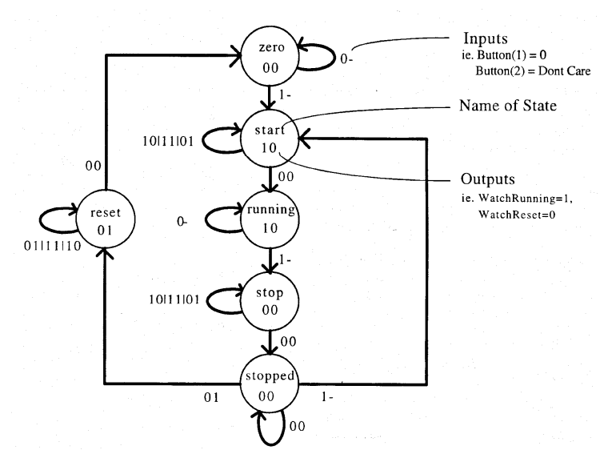

# VHDL Stoppuhr
Dieses Dokument dient als Übersicht der erbrachten Leistungen innerhalb des VHDL-Projektes.

## Implementation des Stoppuhr-Controllers
Der Stoppuhr-Controller wurde als Automat in VDL implementiert. Die Zustände und die Zustandsübergänge des Automaten werden in der folgenden Abbildung veranschaulicht.


Wie dargestellt sind die Zustandsübergänge primär von zwei Knöpfen abhängig:
- Button 1 = Start/Stopp (High-active)
- Button 2 = Reset (High-active)

Es gibt jedoch auch einen dritten Knopf, welcher einen System-Reset auslöst und damit direkt in Zustand "zero" führt:
- Button 3 = System-Reset (Low-active)

Um die Metastabilität zu berücksichtigen, wurden vor jeden Input (Start/Stopp, Reset, System-Reset) jeweils zwei Synchronisations-Flipflops in Reihe geschaltet, die durch einen Prozess verwaltet werden.

Die Ausgänge der Zustände lauten wie folgt:
- Output 1 = Watch running (High-active)
- Output 2 = Watch reset (High-active)

### Testabdeckung
Die zur Verfügung gestellte Testbench wurde in das Projekt eingebunden und für alle Tests benutzt.
Die Testabdeckung liegt bei 100%. Es wurden alle Zuständsübergänge, inklusive der System Resets getestet.


## Selbstentwickelter Test-Preprocessor
Um die Tests des Stoppuhr-Controllers möglichst angenehm zu gestalten, wurde ein C\#/.NET Programm erstellt, welches annotierte CSV Dateien in TXT Dateien umwandelt. Dies ermöglicht es mithilfe von CSV kompatiblen Editoren (wie Microsoft Excel) Testdaten anzulegen und mit Notizen zu versehen, was die Daten auch für Dritte einsichtiger macht. Die Testdaten werden dann ohne die Kommentare in TXT Dateien kopiert, in denen sie so aufbereitet werden, dass sie für das Testframework genutzt werden können.

### CSV Struktur
Damit das C\#-Programm die Testdaten verarbeiten kann, wird der Aufbau der CSV Datei wie folgt vorgeschrieben:
- Die erste Zeile kann für Kommentare o.Ä. verwendet werden.
- Die erste Spalte kann für Kommentare o.Ä. verwendet werden.
- Die Input-Daten fangen ab Zeile 2 Spalte 2 an. Für jedes Input-Feld wird eine neue Spalte hinzugefügt.
- Die Output-Daten werden durch eine leere Spalte von den Input-Daten getrennt. Für jedes Output-Feld wird eine neue Spalte hinzugefügt.
- Ein Input-Output-Datenpaar steht in einer Zeile.

Der folgende Bildschirmausschnitt veranschaulicht die oben beschriebene Struktur anhand eines Beispiels mit drei Input-Feldern und zwei Output-Feldern. **(1)**


### TXT Struktur
Pro CSV Datei werden zwei TXT Dateien erstellt. Eine Datei beinhaltet die Input-Felder und eine Datei beinhaltet die Output-Felder. Daten in verschiedenen Spalten werden durch Leerzeichen separiert. Die Daten werden unter Beeinhaltung der angegebenen Reihenfolge kopiert, jedoch wird der letzte Input-Datensatz, sowie der erste Output-Datensatz zwei Mal eingefügt, da die Zustandsänderung um einen Takt nach hinten verschoben ist.

Die generierten Dateien passend zu Beispiel **(1)** sehen wie folgt aus:

*Input.txt*
```
0 0 0
0 0 1
0 1 1
1 0 1
1 0 1
1 1 1
0 1 1
0 0 1
0 0 1
0 1 1
1 0 1
0 1 1
1 0 1
1 0 1
```

*Output.txt*
```
0 0
0 0
0 0
0 0
1 0
1 0
1 0
1 0
1 0
1 0
1 0
0 0
0 0
0 0
```

